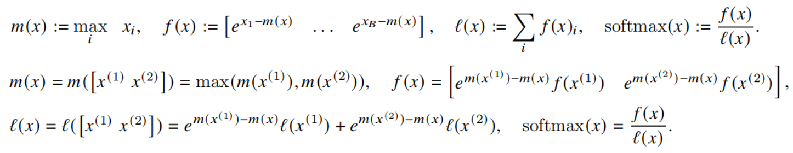
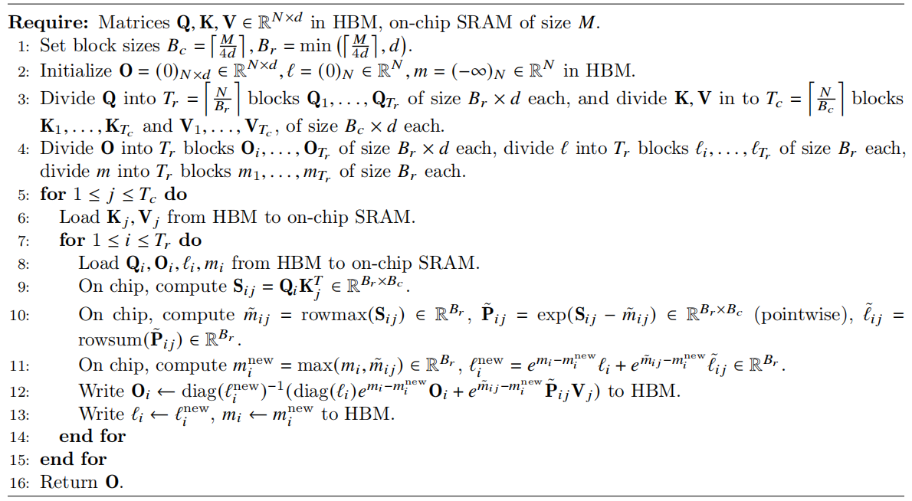

<script src="https://polyfill.io/v3/polyfill.min.js?features=es6"></script>
<script id="MathJax-script" async src="https://cdn.jsdelivr.net/npm/mathjax@3/es5/tex-mml-chtml.js"></script>

# Flash Attention

## Background

GPU 存储包括芯片内 Shared Memory (SRAM) 和芯片外全局显存 (HBM)。SRAM访问速度快，但容量小；HBM 容量大，但访问速度慢。

Softmax 计算需要一整行数据，HBM 中需要存储完整的 QK^T 矩阵，占用 O(n^2)。

传统 Attention 实现过程：

- 从 HBM 加载 Q, K 到 SRAM，访存次数：O(Nd).
- 计算 S = QK^T，计算次数：O(N^2d).
- 从 SRAM 将 S 写回到 HBM，访存次数：O(N^2).
- 从 HBM 加载 S 到 SRAM，访存次数：O(N^2).
- 计算 P = softmax(S)，计算次数：O(N^2).
- 从 SRAM 将 P 写回到 HBM，访存次数：O(N^2).
- 从 HBM 加载 P, V 到 SRAM，访存次数：O(N^2+Nd).
- 计算 O = PV，O(N^2d).
- 从 SRAM 将 O 写回到 HBM，访存次数：O(Nd).

总计算次数：O(N^2d).
总访存次数：O(N^2+Nd).

## Kernel Fusion (算子融合)

算子是 GPU 的基本计算单元，通常对应一段独立的 CUDA 内核代码或库调用。

算子融合通过将多个逻辑上连续的算子合并为一个整体的算子，可以共享中间结果、减少显存访问、内核启动开销。

Flash Attention 将 Attention 计算中的矩阵乘法、softmax 等独立的基本算子融合为一个可以直接调用的算子。

## Tiling

通过中间量 m, f, l 实现 softmax 的分块计算：

- m(x): 当前块 x 的最大值，在计算 softmax 时将指数减去最大值，以保证数值稳定 (safe softmax).
- f(x): 当前块 x 计算 softmax 时的分子部分.
- l(x): 当前块 x 计算 softmax 时的分母部分，即当前 f(x) 的累加和.



## Recomputation

在反向传播中：

- 不存储 O(N^2) 中间量 S, P.
- 存储 O(Nd) 输出矩阵 O, O(N) 中间量 m, l.
- 从 SRAM 中的 Q, K, V 重新计算 S, P.

## Algorithm

Flash Attention 实现过程：

- 在 HBM 中初始化 O, l, m，将 Q, K, V, O分块.
- 外层循环：从 HBM 加载 K，V 的第 j 块到 SRAM，总访存次数：O(Nd).
- 内层循环：从 HBM 加载 Q, O, l, m 的第 i 块到 SRAM，总访存次数：O(Nd+N).
- 计算 S_ij = Q_i·K^T_j，总计算次数：O(N^2d).
- 计算局部 m_ij, P_ij, l_ij，计算次数：O(N^2+N).
- 计算全局 m_i, l_i，计算次数：O(C).
- 计算 O_i，计算次数：O(N^2d).
- 从 SRAM 将 O_i 写回到 HBM，总访存次数：O(Nd).
- 从 SRAM 将 l_i, m_i 写回到 HBM，总访存次数：O(N).

总计算次数：O(N^2d+N).
总访存次数：O(Nd+N).



## Storage Structure (v2)

### Flattened Q/K/V

```
Q/K/V.shape = [Z, H, N_CTX, HEAD_DIM]
y_dim = Z * H * N_CTX
flattened_Q/K/V.shape = [y_dim, HEAD_DIM]
```

```
[Z, H, N_CTX, HEAD_DIM] = [2, 3, 4, 8]

Q/K/V:

    head_0       head_1       head_2
      ^            ^            ^
┌────────────┬────────────┬────────────┐
│ (z=0,h=0)  │ (z=0,h=1)  │ (z=0,h=2)  │  => batch_0
│ [4 x 8]    │ [4 x 8]    │ [4 x 8]    │
├────────────┼────────────┼────────────┤
│ (z=1,h=0)  │ (z=1,h=1)  │ (z=1,h=2)  │  => batch_1
│ [4 x 8]    │ [4 x 8]    │ [4 x 8]    │
└────────────┴────────────┴────────────┘

flattened_Q/K/V:
┌────────────────────────────────────────────────────────────┐
│ head_00   head_01   head_02   head_10   head_11   head_12  │
│ [4 x 8]   [4 x 8]   [4 x 8]   [4 x 8]   [4 x 8]   [4 x 8]  │
└────────────────────────────────────────────────────────────┘
```

### Grid scheduling structure
```
grid.shape = [N_CTX // BLOCK_M, Z * H, 1]
```

```
[BLOCK_M, BLOCK_N] = [2, HEAD_DIM]
assert N_CTX % BLOCK_M == 0 and HEAD_DIM == BLOCK_N
```

```
start_m = tl.program_id(0)      # 当前 Block 在 Grid 中的行索引
off_hz = tl.program_id(1)       # 当前 Block 在 Grid 中的列索引
off_z = off_hz // H             # 当前 Block 对应的 batch 维度索引
off_h = off_hz % H              # 当前 Block 对应的 attention head 索引
# 每个 head 具有独立的一组 Q/K/V，一组 Q/K/V 具有相同的 head 索引
offset_y = off_z * (N_CTX * H) + off_h * N_CTX      # 当前 head 在整个 flattened Q/K/V 张量中的起始行索引
qo_offset_y = offset_y + start_m * BLOCK_M          # 当前 Block 要读取的 Q 子块 在 flatten Q 中起始行索引

logical structure:
<------------------------tl.program_id(1)------------------------->
┌──────────┬──────────┬──────────┬──────────┬──────────┬──────────┐       ^
│ head_000 | head_010 | head_020 | head_100 | head_110 | head_120 │       |
│ [2 x 8]  | [2 x 8]  | [2 x 8]  |  [2 x 8] |  [2 x 8] |  [2 x 8] │       |
│----------|----------|----------|----------|----------|----------│ tl.program_id(0)
│ head_001 | head_011 | head_021 | head_101 | head_111 | head_121 │       |
│ [2 x 8]  | [2 x 8]  | [2 x 8]  | [2 x 8]  | [2 x 8]  | [2 x 8]  │       |
└──────────┴──────────┴──────────┴──────────┴──────────┴──────────┘       v

physical structure: (actual loading method)
┌──────────┐
│ head_000 │
│ [2 x 8]  │
│----------│
│ head_001 │
│ [2 x 8]  │
│----------│
│   ...    │
│----------│
│ head_120 │
│ [2 x 8]  │
│----------│
│ head_121 │
│ [2 x 8]  │
└──────────┘
```

## LogSumExp

## Forward

### Stage 1: Off-band，累计之前位置的注意力贡献

- 处理当前 q 所在 block 之前位置的所有 k/v

```
low, high = 0, start_m * BLOCK_M
```

### Stage 2: On-band，当前位置的注意力计算

- 处理当前 q 所在 block 位置的 k/v 的相同位置部分

```
lo, hi = start_m * BLOCK_M, (start_m + 1) * BLOCK_M
```

- 最后一个 k/v block 中可能包含未来 token（k/v 在 q 的右边），在 causal 模式下需要加掩码：

```
mask = offs_m[:, None] >= (start_n + offs_n[None, :])
qk = qk * qk_scale + tl.where(mask, 0, -1.0e6)
```

## Backward

