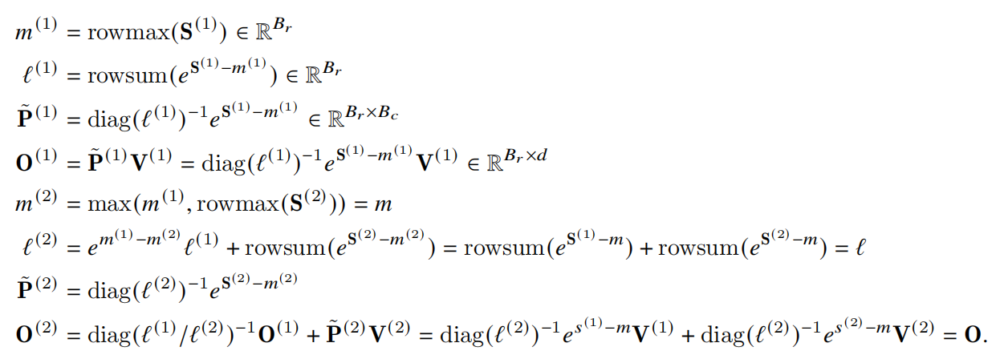
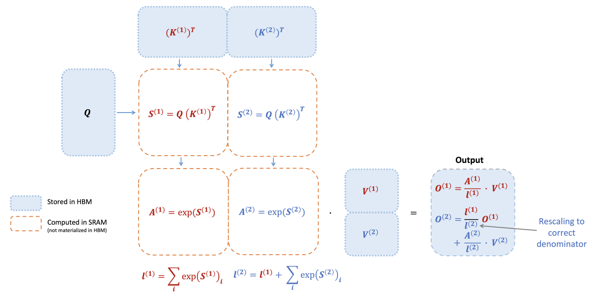
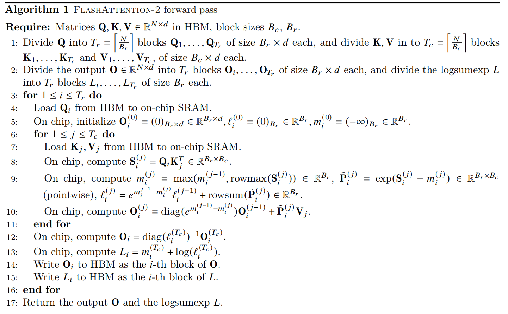
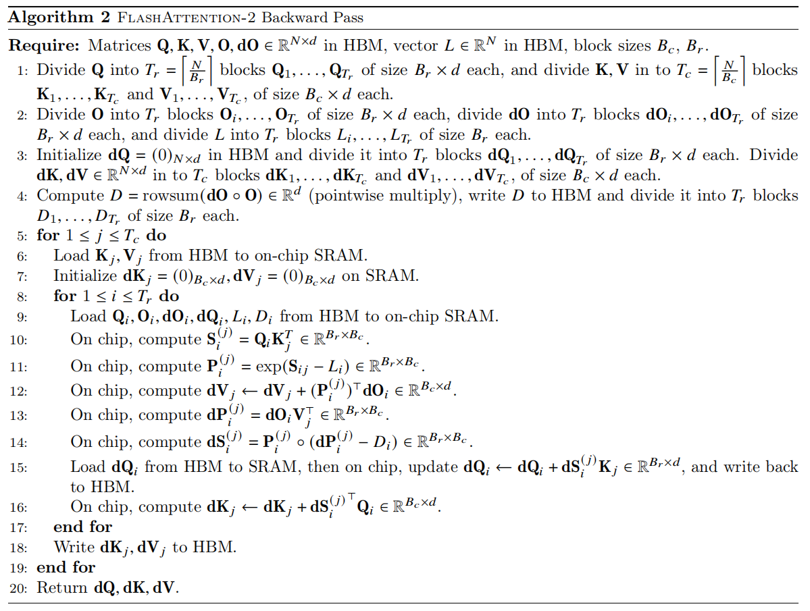

<script src="https://polyfill.io/v3/polyfill.min.js?features=es6"></script>
<script id="MathJax-script" async src="https://cdn.jsdelivr.net/npm/mathjax@3/es5/tex-mml-chtml.js"></script>

# Background

GPU 存储包括芯片内 Shared Memory (SRAM) 和芯片外全局显存 (HBM). SRAM访问速度快，但容量小; HBM 容量大，但访问速度慢.

Softmax 计算需要一整行数据，因此需要读写完整的 `QK^T` 矩阵，访存开销: `O(n^2)`.

## Standard Attention

### Forward Pass

- 从 HBM 加载 `Q, K` 到 SRAM，访存开销: `O(Nd)`.
- 计算 `S = Q · K.T`，计算开销: `O(N^2d)`.
- 从 SRAM 将 `S` 写回到 HBM，访存开销: `O(N^2)`.
- 从 HBM 加载 `S` 到 SRAM，访存开销: `O(N^2)`.
- 计算 `P = softmax(S)`，计算开销: `O(N^2)`.
- 从 SRAM 将 `P` 写回到 HBM，访存开销: `O(N^2)`.
- 从 HBM 加载 `P, V` 到 SRAM，访存开销: `O(N^2+Nd)`.
- 计算 `O = P · V`，计算开销: `O(N^2d)`.
- 从 SRAM 将 `O` 写回到 HBM，访存开销: `O(Nd)`.

总计算开销: `O(N^2d)`, 总访存开销: `O(N^2+Nd)`.

### Backward Pass

- 从 HBM 加载 `P, dO` 到 SRAM, 访存开销: `O(N^2+Nd)`.
- 计算 `dV = P.T · dO`, 计算开销: `O(N^2d)`.
- 从 SRAM 将 `dV` 写回到 HBM, 访存开销: `O(Nd)`.
- 从 HBM 加载 `dO, V` 到 SRAM, 访存开销: `O(Nd)`.
- 计算 `dP = dO · V.T`, 计算开销: `O(N^2d)`.
- 从 SRAM 将 `dP` 写回到 HBM, 访存开销: `O(N^2)`.
- 从 HBM 加载 `P, dP` 到 SRAM, 访存开销: `O(N^2)`.
- 计算 `dS = dsoftmax(dP)`, 计算开销: `O(N^2)`.
- 从 SRAM 将 `dS` 写回到 HBM, 访存开销: `O(N^2)`.
- 从 HBM 加载 `dS, K` 到 HBM, 访存开销: `O(N^2+Nd)`.
- 计算 `dQ = dS · K`, 计算开销: `O(N^2d)`.
- 从 SRAM 将 `dQ` 写回到 HBM, 访存开销: `O(Nd)`.
- 从 HBM 加载 `dS, Q` 到 HBM, 访存开销: `O(N^2+Nd)`.
- 计算 `dK = dS.T · Q`, 计算开销: `O(N^2d)`.
- 从 SRAM 将 `dK` 写回到 HBM, 访存开销: `O(Nd)`.

总计算开销: `O(N^2d)`, 总访存开销: `O(N^2+Nd)`.

# Flash Attention

## Kernel Fusion (算子融合)

算子是 GPU 的基本计算单元，通常对应一段独立的 CUDA 内核代码或库调用.

算子融合通过将多个逻辑上连续的算子合并为一个整体的算子，可以共享中间结果、减少显存访问、内核启动开销.

Flash Attention 将 Attention 计算中的矩阵乘法、softmax 等独立的基本算子融合为一个可以直接调用的算子.

## Tiling

### Online Softmax

通过中间量 `m, f, l` 实现 softmax 的分块计算:

- `m(x)`: 当前块 x 的最大值，在计算 softmax 时将指数减去最大值，以保证数值稳定 (safe softmax).
- `f(x)`: 当前块 x 计算 softmax 时的分子部分.
- `l(x)`: 当前块 x 计算 softmax 时的分母部分，即当前 f(x) 的累加和.





## Recomputation

在反向传播中，根据链式法则:

- `∇V = P.T · ∇O`

标准 Attention 需要存储中间量 `P`，访存开销为 `O(N^2)`.

Flash Attention:

- 不存储 `O(N^2)` 中间量 `P`.
- 存储 `O(Nd)` 输出矩阵 `O` 及 `O(N)` 中间量 `m, l`.
- 加载 `Q, K, V, m, l` 重新计算 `P`.

## Storage Structure (v2)

### Flattened Q/K/V

```
Q/K/V.shape = [Z, H, N_CTX, HEAD_DIM]
y_dim = Z * H * N_CTX
flattened_Q/K/V.shape = [y_dim, HEAD_DIM]
```

```
[Z, H, N_CTX, HEAD_DIM] = [2, 3, 4, 8]

Q/K/V:

    head_0       head_1       head_2
      ^            ^            ^
┌────────────┬────────────┬────────────┐
│ (z=0,h=0)  │ (z=0,h=1)  │ (z=0,h=2)  │  => batch_0
│ [4 x 8]    │ [4 x 8]    │ [4 x 8]    │
├────────────┼────────────┼────────────┤
│ (z=1,h=0)  │ (z=1,h=1)  │ (z=1,h=2)  │  => batch_1
│ [4 x 8]    │ [4 x 8]    │ [4 x 8]    │
└────────────┴────────────┴────────────┘

flattened_Q/K/V:
┌────────────────────────────────────────────────────────────┐
│ head_00   head_01   head_02   head_10   head_11   head_12  │
│ [4 x 8]   [4 x 8]   [4 x 8]   [4 x 8]   [4 x 8]   [4 x 8]  │
└────────────────────────────────────────────────────────────┘
```

### Grid Scheduling Structure
```
grid.shape = [N_CTX // BLOCK_M, Z * H, 1]
```

```
[BLOCK_M, BLOCK_N] = [2, HEAD_DIM]
assert N_CTX % BLOCK_M == 0 and HEAD_DIM == BLOCK_N
```

```
start_m = tl.program_id(0)      # 当前 Block 在 Grid 中的行索引
off_hz = tl.program_id(1)       # 当前 Block 在 Grid 中的列索引
off_z = off_hz // H             # 当前 Block 对应的 batch 维度索引
off_h = off_hz % H              # 当前 Block 对应的 attention head 索引
# 每个 head 具有独立的一组 Q/K/V，一组 Q/K/V 具有相同的 head 索引
offset_y = off_z * (N_CTX * H) + off_h * N_CTX      # 当前 head 在整个 flattened Q/K/V 张量中的起始行索引		# 实际上，offset_y == off_hz * N_CTX
qo_offset_y = offset_y + start_m * BLOCK_M          # 当前 Block 要读取的 Q 子块 在 flatten Q 中起始行索引

logical structure:
<------------------------tl.program_id(1)------------------------->
┌──────────┬──────────┬──────────┬──────────┬──────────┬──────────┐       ^
│ head_000 | head_010 | head_020 | head_100 | head_110 | head_120 │       |
│ [2 x 8]  | [2 x 8]  | [2 x 8]  |  [2 x 8] |  [2 x 8] |  [2 x 8] │       |
│----------|----------|----------|----------|----------|----------│ tl.program_id(0)
│ head_001 | head_011 | head_021 | head_101 | head_111 | head_121 │       |
│ [2 x 8]  | [2 x 8]  | [2 x 8]  | [2 x 8]  | [2 x 8]  | [2 x 8]  │       |
└──────────┴──────────┴──────────┴──────────┴──────────┴──────────┘       v

physical structure: (actual loading method)
┌──────────┐
│ head_000 │
│ [2 x 8]  │
│----------│
│ head_001 │
│ [2 x 8]  │
│----------│
│   ...    │
│----------│
│ head_120 │
│ [2 x 8]  │
│----------│
│ head_121 │
│ [2 x 8]  │
└──────────┘
```

## Forward Pass

### Algorithm (v2)

- 在 HBM 中将 `Q, K, V, O, L` 分块.
- outer (parallel): 从 HBM 加载 `Q_i`到 SRAM. 访存开销: `BLOCK_M * d`.
- 在 SRAM 中初始化 `O, l, m`.
- inner loop: 从 HBM 加载 `K_j, V_j` 到 SRAM. 访存开销: `2 * BLOCK_N * d`.
- 计算 `S_ij = Q_i · K_j.T`. 计算开销: `BLOCK_M * BLOCK_N * d`.
- 计算 `m_ij = max(m_i, rowmax(S_ij))`. 计算开销: `BLOCK_M`.
- 计算 `P_ij = exp(S_ij - m_ij)`. 计算开销: `BLOCK_M * BLOCK_N`.
- 计算修正因子 `alpha = exp(m_i - m_ij)`. 计算开销: `BLOCK_M`.
- 计算 `l_ij = alpha * l_i + rowsum(P_ij)`. 计算开销: `2 * BLOCK_M`.
- 计算 `O_ij = alpha * O_i + P_ij · V_j`. 计算开销: `BLOCK_M * d + BLOCK_M * BLOCK_N * d`.
- outer: 计算 `O_i = O_ij / l_ij`. 计算开销: `BLOCK_M * d`.
- 计算 `L_i = m_ij + log(l_ij)`. 计算开销: `BLOCK_M`.
- 从 SRAM 将 `O_i` 写回到 HBM. 访存开销: `BLOCK_M * d`.
- 从 SRAM 将 `L_i` 写回到 HBM. 访存开销: `BLOCK_M`.



### LogSumExp

############ TODO ############

### Stage 1: off-band (前面所有块)

- 累计之前位置的注意力贡献.
- 处理当前 q 所在 block 之前位置的所有 k/v.

```
low, high = 0, start_m * BLOCK_M
```

### Stage 2: on-band (当前对角块)

- 当前位置的注意力计算.
- 处理当前 q 所在 block 位置的 k/v 的相同位置部分.

```
low, high = start_m * BLOCK_M, (start_m + 1) * BLOCK_M
```

- 最后一个 k/v block 中可能包含未来 token（k/v 在 q 的右边），在 causal 模式下需要加掩码.

```
mask = offs_m[:, None] >= (start_n + offs_n[None, :])
qk = qk * qk_scale + tl.where(mask, 0, -1.0e6)
```

### Stage 3: full attention (非 casual)

- 整个上下文的注意力计算.

```
low, high = 0, N_CTX
```

## Backward Pass

### Algorithm (v2)



### Preprocess

- 从 HBM 加载 `O, dO` 到 SRAM.
- 计算 `D = rowsum(dO * O)`.
- 从 SRAM 将 `D` 写回到 HBM.

### Compute dk, dv

- 固定 `k, v`, 遍历 `q`, 从上到下处理 `K · Q^T` 的一列.

```
# outer
k = tl.load(k_ptrs)	# k.shape = [BLOCK_N1, HEAD_DIM]
v = tl.load(v_ptrs)	# v.shape = [BLOCK_N1, HEAD_DIM]
```

```
# inner loop
for step in range(num_steps):
    qT = tl.load(qT_ptrs)       # qT.shape = [HEAD_DIM, BLOCK_M1]
    m = tl.load(M + offs_m)	# m.shape  = [BLOCK_M1]
    do = tl.load(do_ptrs)       # do.shape = [BLOCK_M1, HEAD_DIM]
    Di = tl.load(D + offs_m)    # Di.shape = [BLOCK_M1]
    ...
```

#### Stage 1: masked blocks (diagonal blocks)

finer-grained slicing:

- 对角块中 q 和 k 的 index 非常接近, 易产生较大 qk 值，更细粒度的划分以使数值稳定. (?)
- 把对角块 [BLOCK_N1, HEAD_DIM] 切分成更小的 [MASK_BLOCK_M1, HEAD_DIM] 子块.

```
num_steps = BLOCK_N1 // MASK_BLOCK_M1
```

casual mask:

- 在 `p.T` 中 `j >= i` 等价于在 `p` 中 `i >= j`.

```
mask = (offs_m[None, :] >= offs_n[:, None])     # j >= i
pT = tl.where(mask, pT, 0.0)
```

#### Stage 2: non-masked blocks (below-diagonal blocks)

```
num_steps = (N_CTX - start_m) // BLOCK_M1
```

### Compute dq

- 固定 `q`, 遍历 `k, v`, 从左到右处理 `Q · K^T` 的一行.

- 此后同理, 略.
