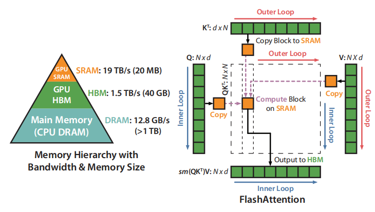

# Flash Attention

The main idea is that we split the inputs Q, K, V into blocks, load them from slow HBM to fast SRAM, then compute the attention output with respect to those blocks. By scaling the output of each block by the right normalization factor before adding them up, we get the correct result at the end.

## Tiling

## Algorithm

