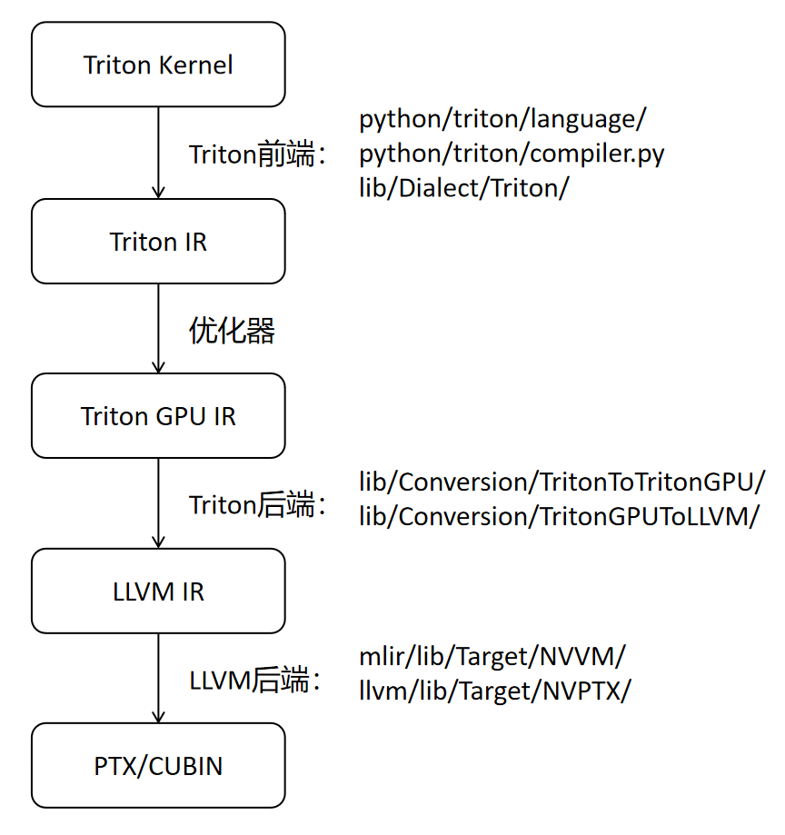

# Triton Learning

## Introduction

`Triton`是一种用于编写高效自定义深度学习原语的语言和编译器。它的目标是提供一个开源环境，让用户能够以比使用 CUDA 更高的生产效率编写快速代码，同时还能比其他现有的领域特定语言（DSL）更具灵活性。

## Triton Installation 

### from source

```
git clone https://github.com/triton-lang/triton.git
cd triton
pip install ninja cmake wheel; # build-time dependencies
pip install -e .
```

`Triton`前端与接口部分使用 Python 实现，而核心部分使用 C++ 实现，这是由于其核心任务涉及矩阵运算等密集型计算，以及对底层硬件指令的精准控制。因此，安装`Triton`涉及对其核心部分的 C++ 代码进行编译。（note: 与后续提到的`Triton kernel`的编译是不同的概念。）

`Triton`的 C++ 核心实现目录为`lib/`，包含：
- `Triton IR`的数据结构和操作
- 编译 Pass管理（优化、调度、IR-Lowering）
- 将`Triton IR`转换为`LLVM IR`的代码
- 调用`LLVM`生成`PTX`的逻辑

最终产物为一个共享库`python/triton/_C/libtriton.so`

## Triton Kernel Compilation (Lowering)

`libtriton.so`是`Triton`的 C++ 编译器核心，其通过`Pybind11`暴露为 Python 可调用模块`triton._C.libtriton`。它通常不会由用户手动调用，而是由`Triton`的 Python 包的内部模块自动使用。

### Python Triton kernel -> Triton IR (TTIR)

- 在 Python 中完成，不直接调用`libtriton.so`

### Triton IR -> LLVM IR (LLIR)

```
# python/triton/compiler.py
libtriton.compile_ttir_to_llir(...)
```

### LLVM IR -> PTX

```
# python/triton/compiler.py
libtriton.compile_llir_to_ptx(...)
```

### PTX -> CUBIN

```
# python/triton/compiler.py
libtriton.link_ptx(...)
```

### Kernel Launch

```
# python/triton/runtime/launcher.py
libtriton.get_function(...)
libtriton.launch(...)
```

### 流程图：


